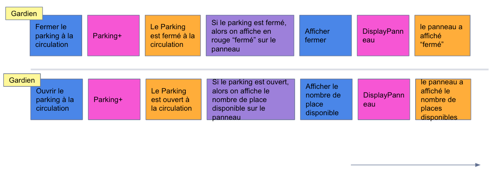

# parking-plus

## Getting started

## Todo

- [ ] extraire l'implémentation dans des fichiers sources (c'est dans les tests pour le moment)
- [ ] renommer le fichier de test :)
- [ ] Software design
- [ ] exposer une route HTTP pour ouvrir le parking

## Ressources

- [Event Storming (process modeling)
](https://docs.google.com/presentation/d/1-XBnyUf5J9UyyKpYZFftjv3IHXzGI5ukFeM2wyaIQEY/edit#slide=id.g22d86bb880c_0_17)
  - 